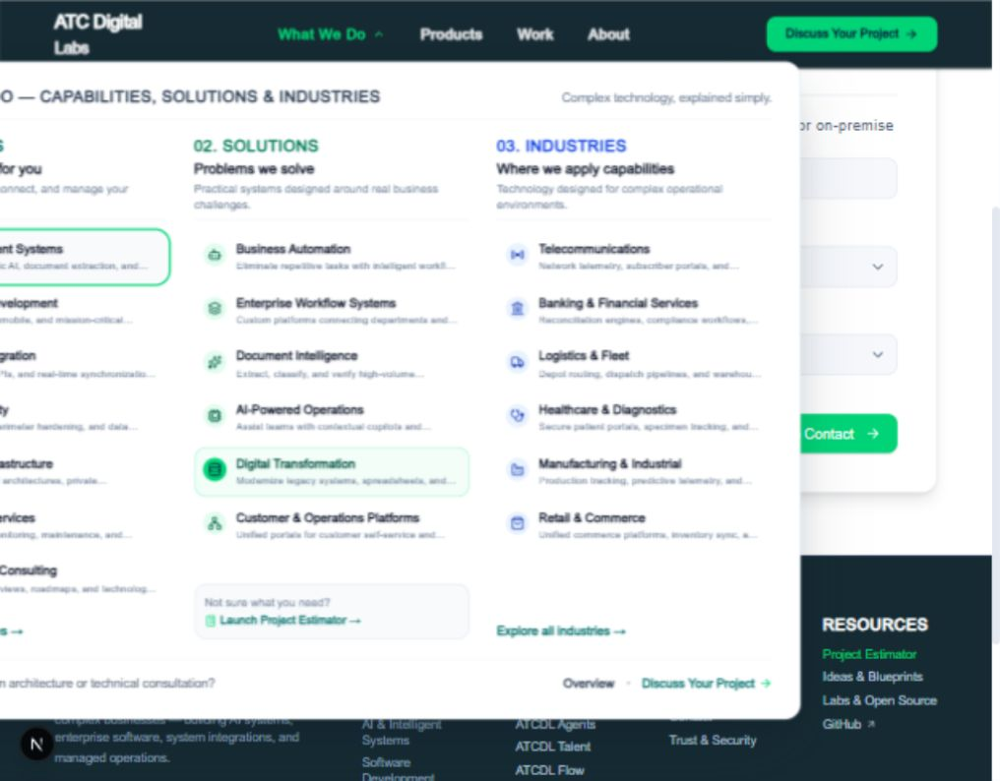
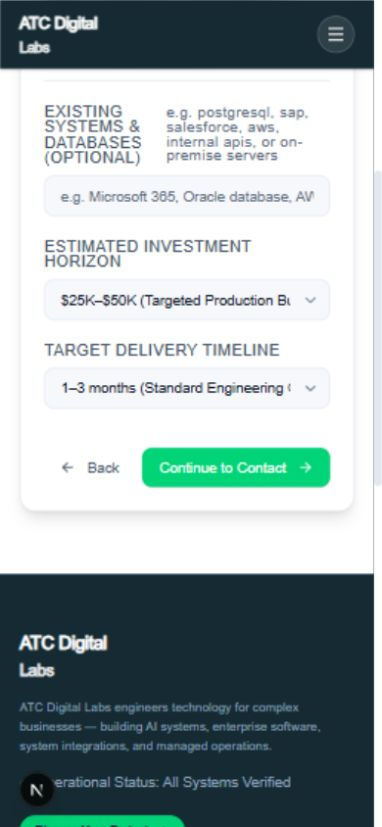

# ATC Digital Labs — UI and UX audit

6 October 2026 · UIAudit / Impeccable technical audit · Repository and local browser review

**Main recommendation: concentrate on a trustworthy, accessible path from understanding your services to making an inquiry.** Your site already has a recognizable navy/teal/green identity, substantial service content, and reusable components. The biggest opportunities are reliable navigation, readable controls, simpler inquiry flows, and evidence that clearly distinguishes prototypes from delivered work.

**Implementation integrity verdict: FAIL for release readiness in the reviewed journeys.** This is not a judgment of your company or its engineering capability. The implementation contains reproducible navigation and filtering defects, inconsistent form values, and success/credibility messages that are stronger than the underlying implementation supports.

## Scope and confidence

- Repository: [Mussab-21/atcdl](https://github.com/Mussab-21/atcdl). Local checkout: `D:/ATC/AI_Profile/nimbrix-web`, commit `bd261fd5cff24bc6b644999337f8a6579f4d8044`. Local HEAD and the local origin/master ref match; homepage and package file were also checked through GitHub. The remote ref was not freshly fetched, so this is a commit-scoped audit, not a guarantee of the latest production deployment.
- Browser review: local development server, homepage, contact/demo steps, products/filter/modal, and industry deep linking. Tested representative desktop (1440 × 1000), tablet/small desktop (1024 × 800), and mobile (390 × 844) viewports. These were targeted checks, not a complete browser/device matrix.
- Source review: shared navigation/footer, design tokens, forms, lead API and schema, estimator handoff, product data, motion, carousel, analytics, and selected route components.
- No real lead was submitted; no email or Discord notification was sent. Delivery failure findings are based on verified source paths, not an induced production outage.
- No live deployment was supplied. No field analytics, user interviews, screen-reader session, production Lighthouse run, or Core Web Vitals measurements were available. Conversion impact is a reasoned hypothesis, not a measured uplift.
- Local server logs reported that Google-hosted Geist fonts could not download, so preview screenshots used fallback fonts. Typography and exact wrapping must be reconfirmed with production fonts; the measured menu clipping applies to this preview. Source-level contrast, data mapping, focus, and delivery findings do not depend on that font substitution.
- UIAudit's context launcher and detector were attempted but could not run because their engine was not installed and its cache directory was not writable. Manual source inspection and browser evidence underpin this report; **there are no automated detector results**. No PRODUCT.md or DESIGN.md was found in the local project search.
- Application source was not changed. Report and screenshots are separate artifacts.

## Audit health

Scores use the plugin's 0–4 rubric. They are provisional assessments of the reviewed implementation, not compliance certification or performance benchmarks.

| Dimension | Score | Main finding |
|---|---:|---|
| Accessibility | 1/4 | Primary action contrast, modal focus, and form error handling need substantial work. |
| Performance | 2/4 | Some sensible motion guards exist, but idle animations and reveal dependencies remain. Source-only score; production speed unmeasured. |
| Responsive design | 2/4 | Responsive grids work, but the tablet menu clips and mobile form layout is cramped. |
| Theming | 2/4 | Useful tokens exist; incorrect semantic color use and hard-coded variants undermine consistency. |
| Implementation integrity | 1/4 | Navigation, filters, form state, and confirmation messages disagree with user expectations. |
| **Total** | **8/20** | **Poor under the plugin rubric: major remediation in shared interactions.** |

The score does not imply a complete visual rebuild is necessary. Many failures originate in shared components and data mappings, so focused repairs can improve several pages at once.

**20 findings: 0 confirmed P0 blockers, 8 P1 major issues, 12 P2 issues, 0 P3 polish items.** The lead-delivery failure path is urgent despite not being reproduced against a live backend.

## What to focus on first

| Order | Focus | Why it matters to the business | First deliverable |
|---|---|---|---|
| 1 | Inquiry correctness and recovery | Visitors need their request to reach you, carry the correct context, and produce an honest confirmation. | One canonical service model, reliable delivery acknowledgement, actionable errors. |
| 2 | Navigation and accessibility | People must be able to read actions, reach services, and use dialogs without a mouse. | Responsive menu, accessible button colors, focus management. |
| 3 | Product and industry discovery | Category labels and links currently lead to unexpected or empty results. | Correct filters, direct links, URL-backed industry selection. |
| 4 | Credibility and content clarity | Prototypes, simulations, operational status, and production claims need a clear distinction. | Evidence-backed case studies and consistent availability labels. |
| 5 | Reading comfort and measurement | Excess motion and dense technical language increase effort; incomplete funnel events hide where visitors struggle. | Simpler inquiry copy, deliberate motion, measured conversion funnel. |

## Detailed findings

### F01 · P1 · Primary action colors fail text contrast

**Category:** Accessibility / Theming. **Evidence:** Source plus rendered buttons. [Button.tsx:39](https://github.com/Mussab-21/atcdl/blob/bd261fd5cff24bc6b644999337f8a6579f4d8044/src/components/ui/Button.tsx#L39), [tokens.css](https://github.com/Mussab-21/atcdl/blob/bd261fd5cff24bc6b644999337f8a6579f4d8044/src/styles/tokens.css).

Primary buttons use white text on `#00D477`: **1.97:1** contrast. The hover green `#00B565` gives **2.69:1** against white. Small green links on white have the same low ratio. Normal text needs 4.5:1; large text needs 3:1 under [WCAG 1.4.3](https://www.w3.org/WAI/WCAG22/Understanding/contrast-minimum.html). The bright end of the headline gradient also warrants correction. Ratios were calculated from source colors, not screenshot pixels.

**Impact:** Important actions are difficult to read, especially in bright conditions or with low vision. **Fix:** Keep bright green as a brand fill, pair it with dark text as the header already does, and use a darker link token on light backgrounds. Give focus rings their own sufficiently contrasting token. **Acceptance:** Check normal, hover, focus, and disabled states across button variants and light/dark sections. **Suggested command:** `/impeccable colorize`.

### F02 · P1 · The desktop menu extends outside the tablet viewport

**Category:** Responsive. **Evidence:** Browser measurement and [Navbar.tsx:309](https://github.com/Mussab-21/atcdl/blob/bd261fd5cff24bc6b644999337f8a6579f4d8044/src/components/layout/Navbar.tsx#L309).

At 1024px wide, the open menu measured **left −140.17px, right 819.83px, width 960px**. Its first column is visibly cut off. The panel is centered on the trigger rather than the viewport/container. A `max-width` restriction cannot correct its position.

**Impact:** Service labels and links become partially hidden at common laptop/tablet widths. **Fix:** Anchor the panel to the header container or viewport, constrain both edges, and switch to a stacked drawer when the full menu no longer fits. **Acceptance:** No clipping at 768, 820, 1024, 1280, or 1440px; keyboard focus remains visible. **Suggested command:** `/impeccable adapt`.

### F03 · P1 · The inquiry API can confirm success without durable delivery

**Category:** Implementation Integrity. **Evidence:** Verified failure path in [leads/route.ts:95](https://github.com/Mussab-21/atcdl/blob/bd261fd5cff24bc6b644999337f8a6579f4d8044/src/app/api/leads/route.ts#L95) through the success response at line 150; notification handling in `src/lib/leads/notify.ts`.

Database failure is caught, a timestamp-based reference remains, and the API returns `ok: true` without requiring successful persistence or notification. The confirmation page says the brief was received and logged. Directly opening that page without a reference also generates a plausible random reference.

**Impact:** Under a delivery failure, a prospect could believe you received an inquiry that your team cannot recover. **Fix:** Acknowledge success only after durable persistence or a reliable queue accepts the request; retain entered text on failure and provide retry/fallback contact. Do not fabricate a received-reference state on direct visits. **Acceptance:** In an isolated test environment, disable persistence and delivery and confirm that success is not shown; verify successful storage before showing a receipt. **Suggested command:** `/impeccable harden`.

### F04 · P1 · Product dialogs do not establish an accessible modal interaction

**Category:** Accessibility. **Evidence:** Browser opened “Inspect Full Specifications”; focus remained on that background button. The dialog had neither `aria-label` nor `aria-labelledby`. [ProductDetailModal.tsx:39](https://github.com/Mussab-21/atcdl/blob/bd261fd5cff24bc6b644999337f8a6579f4d8044/src/components/products/ProductDetailModal.tsx#L39). The shared `ui/Modal.tsx` also lacks a focus trap.

**Impact:** Keyboard and assistive-technology users can remain in the obscured page instead of entering the product details. **Fix:** Name the dialog from its heading, move focus inside, contain Tab navigation, make the background inert, and restore focus to the opener after close. Preserve Escape support. **Acceptance:** Complete the open/read/action/close flow using only a keyboard. Follow the [WAI modal-dialog pattern](https://www.w3.org/WAI/ARIA/apg/patterns/dialog-modal/). **Suggested command:** `/impeccable harden`.

### F05 · P1 · Form errors and step changes are not communicated reliably

**Category:** Accessibility / Implementation Integrity. **Evidence:** [ContactFormClient.tsx:194](https://github.com/Mussab-21/atcdl/blob/bd261fd5cff24bc6b644999337f8a6579f4d8044/src/components/forms/ContactFormClient.tsx#L194), line 239, and line 323; `Form.tsx` already has unused field-error support.

The top-level error lacks an alert/live-region role, does not associate the message with the failing input, and uses an undefined `--danger` token. API field-error details are discarded in favor of a generic error. Advancing steps removes the focused button without directing focus to the new heading. The mobile browser remained scrolled down, with the new heading partly behind the fixed header.

**Impact:** Visitors can miss why progress failed or where the next step begins. **Fix:** Use field-level errors and a focused error summary; use `--error`; focus/scroll the next heading into view with the real header offset. Expose required state programmatically. **Acceptance:** Empty/invalid fields are announced and identified; Back preserves input; every new step begins at a visible heading. Relevant checks include WCAG 3.3.1, 4.1.3, and 2.4.3. **Suggested command:** `/impeccable harden`.

### F06 · P1 · The displayed service choice and stored classification diverge

**Category:** Implementation Integrity. **Evidence:** [ContactFormClient.tsx:59](https://github.com/Mussab-21/atcdl/blob/bd261fd5cff24bc6b644999337f8a6579f4d8044/src/components/forms/ContactFormClient.tsx#L59), options beginning near line 352; [score.ts:56](https://github.com/Mussab-21/atcdl/blob/bd261fd5cff24bc6b644999337f8a6579f4d8044/src/lib/leads/score.ts#L56).

State defaults to `Custom AI / GenAI`, which is absent from the actual options. The browser displays “Automate an operational process.” Changing the choice stores new business-language values, but lead scoring recognizes the old labels and falls back to five points for every new choice. The API accepts strings, so this is **not a proven validation rejection**.

**Impact:** The visible selection can misrepresent the submitted default; manually selected services receive inconsistent internal prioritization. **Fix:** Share stable service IDs between options, defaults, query mappings, API validation, and scoring. Separate human-readable labels from IDs. Start with a deliberate placeholder or valid default. **Acceptance:** Every visible choice round-trips to the expected service and score; leaving the default unchanged submits what is shown. **Suggested command:** `/impeccable harden`.

### F07 · P1 · Confidentiality messages conflict with the implementation

**Category:** Implementation Integrity. **Evidence:** [thank-you/page.tsx:55](https://github.com/Mussab-21/atcdl/blob/bd261fd5cff24bc6b644999337f8a6579f4d8044/src/app/contact/thank-you/page.tsx#L55), notification integrations in `src/lib/leads/notify.ts`.

The confirmation promises no third-party data sharing and describes “mutual NDA standards,” while configured delivery paths send inquiry details through Discord and Resend. No mutual NDA acceptance is established by the reviewed flow.

**Impact:** Prospects cannot accurately understand how their inquiry will be handled. This is a product-copy inconsistency, not a legal compliance determination. **Fix:** Describe actual processing and confidentiality practices, link the relevant privacy information beside submission, and reserve contractual NDA language for an actual agreement. **Acceptance:** Form, receipt, privacy information, and deployed delivery configuration tell the same story. **Suggested command:** `/impeccable clarify`.

### F08 · P1 · The main headline updates indefinitely without a pause control

**Category:** Accessibility. **Evidence:** [RotatingHeadlineWord.tsx:60](https://github.com/Mussab-21/atcdl/blob/bd261fd5cff24bc6b644999337f8a6579f4d8044/src/components/motion/RotatingHeadlineWord.tsx#L60).

The headline changes every 2.6 seconds. Reduced-motion preference is checked at mount, but readers without that preference have no stop/pause control for this auto-updating text. Other homepage sections do provide pause buttons, making the behavior inconsistent.

**Impact:** Readers can lose their place while trying to understand the main proposition. **Fix:** Prefer a stable headline, or expose a persistent accessible pause control; respect preference changes during the session. **Acceptance:** A visitor can stop updates without leaving the page; reduced-motion mode preserves all essential content. Check WCAG 2.2.2. **Suggested command:** `/impeccable animate`.

### F09 · P2 · Mobile form typography is cramped and overly technical

**Category:** Responsive / Implementation Integrity. **Evidence:** 390px browser inspection; [Form.tsx:30](https://github.com/Mussab-21/atcdl/blob/bd261fd5cff24bc6b644999337f8a6579f4d8044/src/components/ui/Form.tsx#L30).

Labels and long help text share one flex row inside the label. This produces narrow stacked words; the help text also becomes part of the accessible label. Budget/timeline option labels truncate. Even a demo request passes through the same three-step scope, systems, and budget flow, with a preselected $25K–$50K budget.

**Impact:** A prospect asking for a demonstration must do unnecessary interpretation and may mistake a default budget for a requirement. **Fix:** Place help text below labels, use readable sentence case and shorter choices, default unknown budget to “Not sure,” and give demo inquiries a short product/name/email flow with optional context. Suggested wording: “What would you like to improve?”, “Budget range (optional),” and “When would you like to start?” **Acceptance:** At 320–390px, each field has a clear label, full help text, and a readable selected value; demos do not require a project specification. **Suggested commands:** `/impeccable adapt`, `/impeccable clarify`.

### F10 · P2 · Industry navigation does not select the requested industry

**Category:** Implementation Integrity. **Evidence:** Opening `/industries#banking` rendered active Telecom content. [IndustriesExplorerClient.tsx:17](https://github.com/Mussab-21/atcdl/blob/bd261fd5cff24bc6b644999337f8a6579f4d8044/src/components/industries/IndustriesExplorerClient.tsx#L17) initializes Telecom without reading the hash. Navbar also advertises Healthcare and Retail while the reviewed explorer offers four industries.

**Impact:** Visitors lose the context they selected and may assume the company lacks the relevant expertise. **Fix:** Use validated industry detail routes or synchronize selection with a URL parameter/hash; reconcile menu entries with available content. **Acceptance:** Each industry menu link opens the matching industry, and reload/back/forward preserve selection. **Suggested command:** `/impeccable harden`.

### F11 · P2 · Communication filtering hides its own product

**Category:** Implementation Integrity. **Evidence:** Browser showed “Communication 0” and an empty catalog after selection. [products-lab-data.ts:166](https://github.com/Mussab-21/atcdl/blob/bd261fd5cff24bc6b644999337f8a6579f4d8044/src/content/products-lab-data.ts#L166) labels ATCDL Agents as Communication but omits that category from its filter categories. `ProductsLabClient.tsx:29` and line 42 filter on the latter.

**Impact:** A relevant product disappears exactly when a visitor searches for it. **Fix:** Derive badge/category membership from one source and provide an informative empty state with Clear filters. **Acceptance:** Communication includes ATCDL Agents and counts match visible results for every category. **Suggested command:** `/impeccable harden`.

### F12 · P2 · Contact pages display “Concept” instead of their intended badge

**Category:** Implementation Integrity. **Evidence:** Browser demo page showed “CONCEPT.” [ContactFormClient.tsx:269](https://github.com/Mussab-21/atcdl/blob/bd261fd5cff24bc6b644999337f8a6579f4d8044/src/components/forms/ContactFormClient.tsx#L269) supplies a `Concept` status plus intent text, but [Badge.tsx:42](https://github.com/Mussab-21/atcdl/blob/bd261fd5cff24bc6b644999337f8a6579f4d8044/src/components/ui/Badge.tsx#L42) replaces children with the status.

**Impact:** The inquiry page itself looks like an unfinished concept. **Fix:** Separate semantic status from visual variant, and render the intended project/demo/consultation label. **Acceptance:** All three intents display the correct badge. **Suggested command:** `/impeccable clarify`.

### F13 · P2 · Carousel clones remain in the accessibility and keyboard structure

**Category:** Accessibility. **Evidence:** The homepage accessibility tree listed seven product cards for four products, including repeated Docs, Ask, and Agents links. [ProductsCarousel.tsx:100](https://github.com/Mussab-21/atcdl/blob/bd261fd5cff24bc6b644999337f8a6579f4d8044/src/components/sections/ProductsCarousel.tsx#L100) appends clones and line 297 renders them without inert/hidden handling.

**Impact:** Keyboard and screen-reader users navigate duplicate and offscreen content. **Fix:** Manage visible slides explicitly; remove inactive/cloned controls from focus and accessibility exposure, or use a simpler scrollable list without duplicates. **Acceptance:** Tab visits only available controls, each product is announced once, and focus never disappears behind clipping. **Suggested command:** `/impeccable harden`.

### F14 · P2 · Shared interaction semantics need consolidation

**Category:** Accessibility. **Evidence:** `Button.tsx` always renders a button, while homepage and navbar wrap buttons in links; browser DOM confirms nested interactive elements. [Navbar.tsx:575](https://github.com/Mussab-21/atcdl/blob/bd261fd5cff24bc6b644999337f8a6579f4d8044/src/components/layout/Navbar.tsx#L575) lacks mobile expanded-state attributes. The mobile drawer has no dedicated focus containment. Desktop navigation uses menu roles without the full menu keyboard interaction pattern.

**Impact:** Shared components can expose ambiguous actions and hidden navigation state. **Fix:** Use styled anchors for navigation, buttons for actions, disclosure semantics for site navigation, and explicit expanded/control attributes. If the mobile drawer is modal, implement the complete modal pattern. **Acceptance:** One semantic control per action; announced open/closed state; logical keyboard navigation and visible focus. **Suggested command:** `/impeccable harden`.

### F15 · P2 · Solution inquiry context is dropped

**Category:** Implementation Integrity. **Evidence:** [SolutionsHorizontalSelector.tsx:306](https://github.com/Mussab-21/atcdl/blob/bd261fd5cff24bc6b644999337f8a6579f4d8044/src/components/sections/SolutionsHorizontalSelector.tsx#L306) links with `?solution=...`; the contact component reads product, idea, industry, projectType, budget, timeline, summary, service, and intent, but not solution.

**Impact:** Someone choosing a particular solution lands on a generic form and must repeat their selection. **Fix:** Normalize all entry links into the canonical inquiry model and show a small editable “Interested in…” summary. **Acceptance:** Every homepage/service/solution/product/estimator CTA preserves the relevant intent in the form and submitted record. **Suggested command:** `/impeccable harden`.

### F16 · P2 · Credibility signals overstate or blur the supporting evidence

**Category:** Implementation Integrity. **Evidence:** [Footer.tsx:31](https://github.com/Mussab-21/atcdl/blob/bd261fd5cff24bc6b644999337f8a6579f4d8044/src/components/layout/Footer.tsx#L31) hard-codes “All Systems Verified”; `OperationalBottleneckVisual.tsx:109` presents a 30%+ figure; `IndustryWhatWeBuildSection.tsx:148` says “100% Deterministic Safety”; `data.ts:379` asserts zero hallucination. Product data labels four products Prototype and two Concept, while other product copy describes ready-to-deploy engines.

**Impact:** Buyers cannot distinguish an illustrative diagram, a benchmark, an aspiration, and production evidence. **Fix:** Label simulations and example metrics; attach scope/date/method to measured claims; distinguish currently available, pilot, prototype, and concept capabilities consistently. Keep the existing honest status badges. **Acceptance:** Every quantitative or absolute claim has inspectable support or appropriately qualified wording; status labels and CTAs agree across cards, modals, and detail pages. **Suggested command:** `/impeccable clarify`.

### F17 · P2 · Product and evidence links are less specific than their labels

**Category:** Implementation Integrity. **Evidence:** [Footer.tsx:97](https://github.com/Mussab-21/atcdl/blob/bd261fd5cff24bc6b644999337f8a6579f4d8044/src/components/layout/Footer.tsx#L97) and subsequent product links all point to `/products`. Project `githubUrl` entries in `data.ts` point to the GitHub profile, not individual repositories.

**Impact:** Visitors must search again after choosing a specific product or trying to verify a project. **Fix:** Deep-link to each product and actual project repository/demo. If evidence is private, state that and provide a suitable case-study summary instead of a generic source link. **Acceptance:** Link destination matches the product/project named by its label. **Suggested command:** `/impeccable clarify`.

### F18 · P2 · Motion continues where its performance value is unclear

**Category:** Performance. **Evidence:** `HeroBusinessFlowVisual.tsx:122` and line 147 repeat shadow/float animations indefinitely without viewport pausing; `MethodologyInteractiveRail.tsx:91` cycles outside viewport awareness; `ProductsCarousel.tsx:294` keeps `will-change: transform` active at rest. `CursorGlow.tsx` reads card bounds on pointer movement and updates a radial gradient.

**Impact:** These patterns can spend main-thread/paint/compositing work without helping an offscreen visitor. Actual frame drops or poor Core Web Vitals were **not measured**. **Fix:** Pause offscreen work, prefer short transform/opacity transitions, remove permanent promotion hints where unnecessary, and profile the production build before larger optimizations. **Acceptance:** Record performance traces on a representative mobile device; no unnecessary offscreen animation work, and no regression in measured interaction latency. **Suggested command:** `/impeccable optimize`.

### F19 · P2 · Essential content depends on successful reveal initialization

**Category:** Implementation Integrity / Performance. **Evidence:** [layout.tsx:53](https://github.com/Mussab-21/atcdl/blob/bd261fd5cff24bc6b644999337f8a6579f4d8044/src/app/layout.tsx#L53) immediately adds `js`; [globals.css:96](https://github.com/Mussab-21/atcdl/blob/bd261fd5cff24bc6b644999337f8a6579f4d8044/src/app/globals.css#L96) hides all reveal blocks for normal motion preference. The noscript fallback only helps when scripting is disabled, not when later bundles fail.

**Impact:** A partial JavaScript failure can leave server-rendered copy and actions invisible. This is a verified dependency risk, not a reproduced production failure. **Fix:** Keep content visible by default and enable concealment only after an animation is ready, with a fail-open path. **Acceptance:** Test JavaScript disabled, interrupted client bundle loading, and animation initialization failure; essential content and navigation remain usable. **Suggested command:** `/impeccable harden`.

### F20 · P2 · Funnel instrumentation cannot explain most visitor drop-off

**Category:** Implementation Integrity. **Evidence:** `src/lib/analytics.ts` declares hero click, contact start, and estimator start events, but source search found no call sites for those events. Contact success and estimator completion are instrumented; estimator completion fires before the handoff result. The analytics adapter only sends when an external provider is already loaded.

**Impact:** It is difficult to tell whether people misunderstand the offer, fail to navigate, abandon a form step, or encounter submission errors. **Fix:** Add CTA click, form start, step viewed/completed, validation failure, API failure, durable success, and handoff success events; verify the deployed provider. Keep free-text inquiry content and personal data out of analytics. **Acceptance:** One successful and one failed test journey produce correctly ordered, nonduplicated events with device and entry-intent context. **Suggested command:** `/impeccable harden`.

## User journeys and design implications

| Journey | What currently gets in the way | Recommended experience |
|---|---|---|
| Business buyer looking for help | Seven services, six solution menu labels, technical diagrams, and a long inquiry can make the next step feel like an architecture exercise. | Explain the business problem and outcome first; offer one clear project conversation CTA with optional detail. |
| Buyer looking for an industry specialist | Banking link opens Telecom; menu coverage differs from explorer coverage. | A shareable industry page with matching title, relevant work, and context-preserving inquiry. |
| Product evaluator | Communication filter hides a matching product; prototype status and deployment language differ; modal focus is incomplete. | Clear availability status, accurate filters, inspectable product evidence, and a short demo request. |
| Keyboard/mobile visitor | Clipped menu, low-contrast actions, modal focus, cramped form labels, and duplicate carousel links. | Predictable controls, readable states, deliberate focus movement, and no offscreen interactions. |
| Technical evaluator | Deep technical language exists, but source links often lead only to a profile and absolute claims lack adjacent evidence. | Actual repository/demo links, deployment constraints, scoped benchmark methods, and clearly labeled examples. |

These are design hypotheses grounded in implementation evidence. Validate them with representative buyers rather than treating them as measured user behavior.

## What is working and should be preserved

- The dark header and light content provide a recognizable brand structure. Green can remain the accent once text/background pairings are corrected.
- The four main desktop navigation groups are a manageable top-level structure. Fix the menu implementation before replacing the whole information architecture.
- The homepage explains operational problems and includes work, process, and product sections; it has the right raw material for a buyer journey.
- Several products and projects are explicitly labeled Prototype, Concept, Internal Project, or Client Project. That transparency is valuable.
- `FormField` creates stable label/input associations and supports descriptions and errors; connect its existing accessibility features to actual validation.
- The capability ticker, solutions selector, and product carousel already include pause controls and reduced-motion handling. The carousel also stops when out of view.
- The project uses reusable button/card/badge primitives, CSS variables, responsive grids, semantic main/navigation landmarks, and page metadata. Improvements can be applied systematically.

## Systemic causes

**One label has several definitions.** Service choices differ between the form and scoring; product display category differs from filter membership; industry link labels differ from selected content. Establish canonical IDs and one source for each taxonomy.

**Visual state and real state are mixed.** “Concept” overrides a contact badge; static status text looks operational; success can appear without durable receipt. Treat labels, availability, delivery, and validation as explicit states with real data behind them.

**Accessibility is implemented locally rather than consistently.** Some widgets have pause buttons and good labels while other widgets lack focus or state management. Reuse complete interaction patterns, not only visual styling.

**Technical detail arrives too early.** Main flows ask buyers to interpret architecture, investment horizons, and systems before a simple conversation. Keep that detail available, but progressively disclose it after intent is clear.

## Recommended implementation sequence

| Phase | Work | Suggested owner | Exit criteria |
|---|---|---|---|
| 1 — Protect inquiries | F03, F05, F06, F07, F12, F15 | Frontend + backend + company owner for factual copy | Correct fields, honest receipts, accessible recovery, consistent privacy copy. |
| 2 — Repair shared UI | F01, F02, F04, F08, F09, F13, F14 | Frontend + design | Readable actions; menu fits; keyboard/mobile journeys complete. |
| 3 — Make discovery credible | F10, F11, F16, F17 | Frontend + content/company owner | Filters and deep links work; product readiness and evidence agree. |
| 4 — Measure and simplify | F18, F19, F20 | Frontend + analytics | Resilient content, performance baseline, usable funnel data. |

This is sequencing, not a time estimate. Backend delivery and approved business evidence may take longer than visual component changes.

Suggested command sequence: `/impeccable harden` → `/impeccable colorize` → `/impeccable adapt` → `/impeccable clarify` → `/impeccable animate` → `/impeccable optimize` → `/impeccable audit` → `/impeccable polish`. These are suggested follow-up workflows; only the audit was performed here.

## How to validate improvement

1. Test a buyer choosing Banking, a visitor filtering Communication products, a demo request, an estimator handoff, and a general project inquiry. Record completion, wrong turns, missing context, and recovery from errors.
2. Repeat keyboard-only testing of navigation, forms, carousel, and product dialogs. Include screen-reader testing and automated accessibility checks on a production build.
3. Cover 320/390px phones, 768/820px tablets, 1024px laptops, larger desktops, 200% text scaling/zoom, and reduced-motion preferences. Do not equate absence of horizontal scroll with absence of clipping.
4. Test persistence/delivery failure in an isolated environment. Confirm there is no false success and no lost user text.
5. Measure production performance before and after motion changes. Do not use local development-server timings as a production benchmark.
6. Establish baseline inquiry start/completion, completion by step and device, validation/API failure rate, product-to-demo progression, and qualified inquiry rate. Set improvement targets after a representative baseline exists.

Target size nuance: 44 × 44 CSS pixels is a useful comfort target, not a blanket WCAG AA minimum. [WCAG 2.2 SC 2.5.8](https://www.w3.org/WAI/WCAG22/Understanding/target-size-minimum.html) uses 24 × 24 CSS pixels with exceptions and spacing rules. The existing 24–36px icon controls deserve usability review, but this report does not label every sub-44px control a compliance failure.

You can ask me to run the follow-up work one at a time, all at once, or in any order you prefer. Re-run `/impeccable audit` after fixes to reassess the score.
